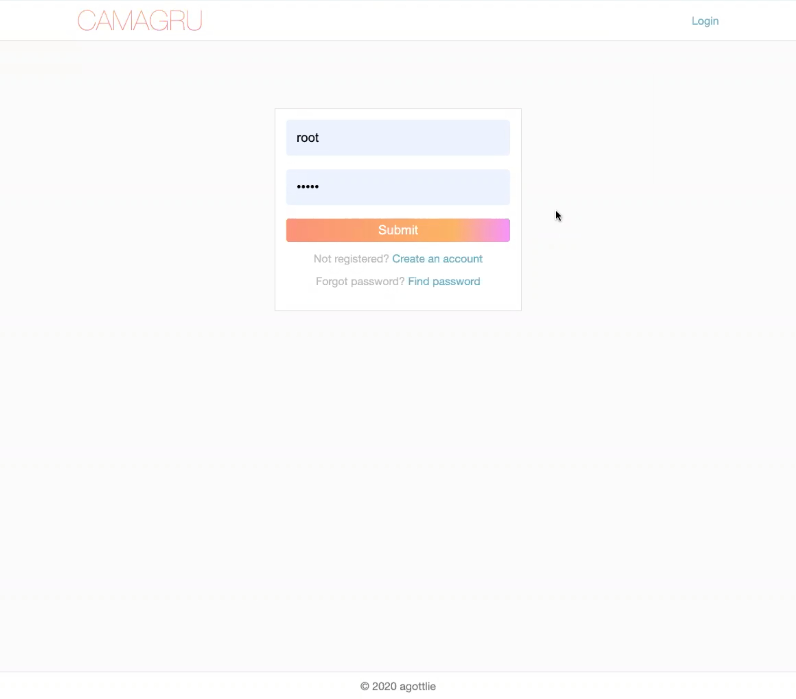
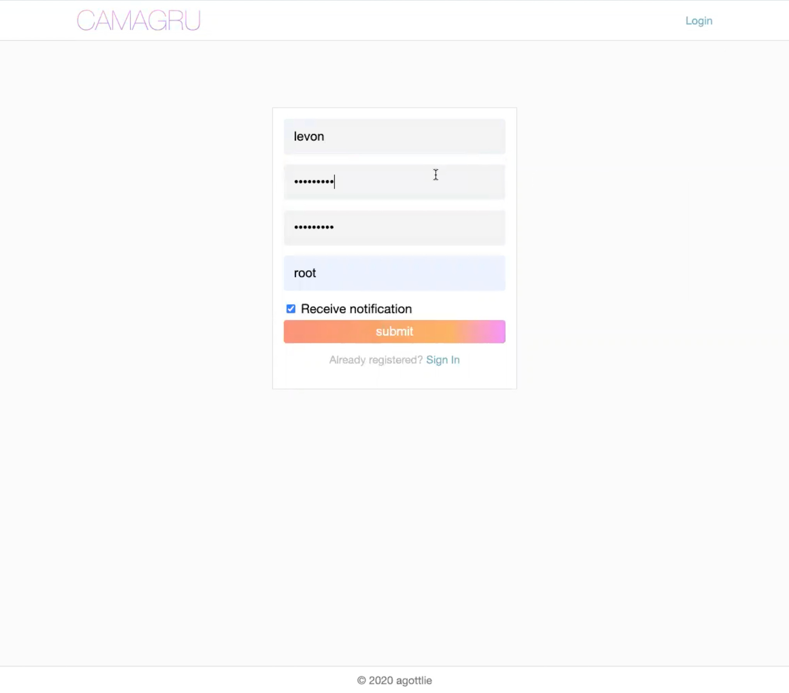
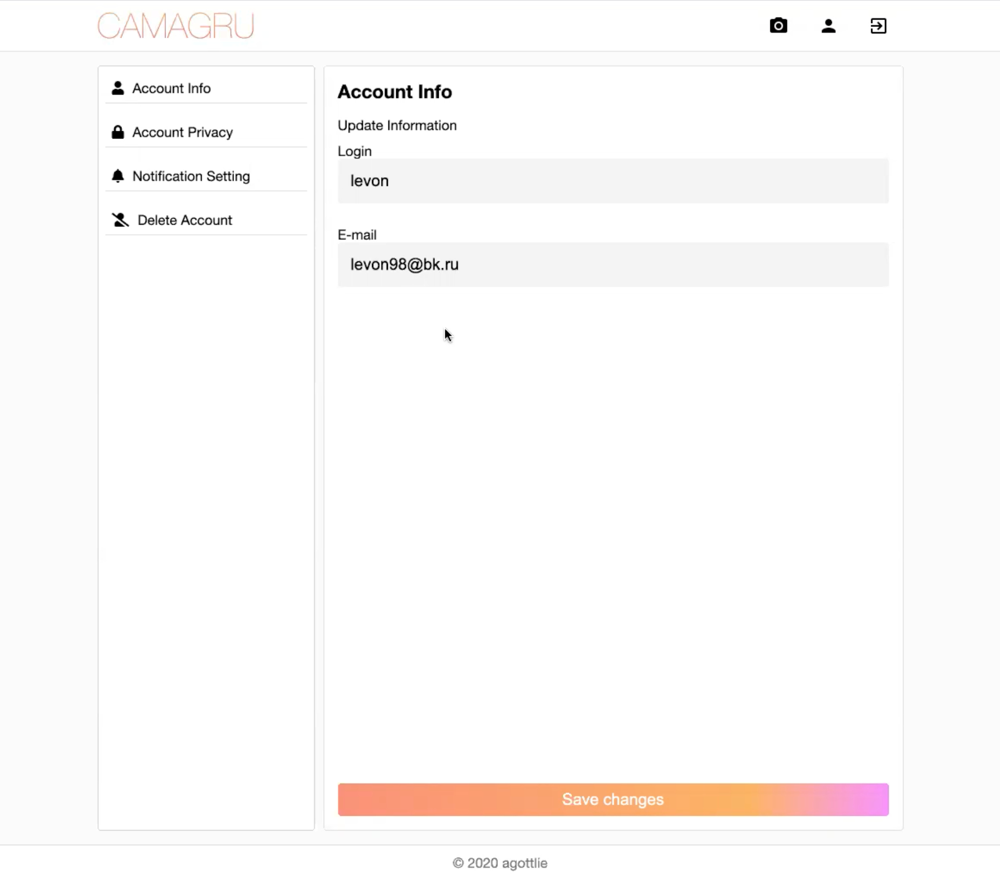

# Camagru

Camagru is a School 42 project. 
The purpose of this project is to create is to create a web application allowing you to make photo using your webcam and share them with others.

[`camagru.en.pdf`](/camagru.en.pdf) is the task file.

## Final score

125/100 (max)

## Overview

### Sign in/Register

    
    

### Settings

